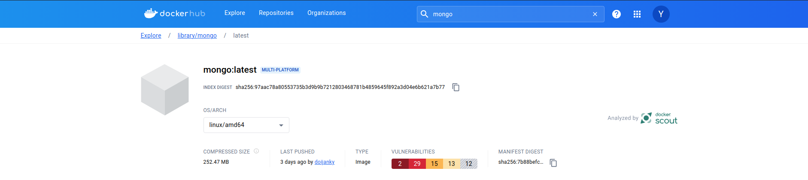

# Requirements

To run this e-commerce Application, one needs 3 docker images as highlighted below:-

- Images are named using semver versioning syntax

1. ymwambeyu/yolo-frontend:v1.0.0 (front-end)

    

2. ymwambeyu/yolo-backend:v1.0.0 (back-end)

    

3. mongo:latest (mongo-db)

    - No Dockerfile is needed for the database container as it's using an official image directly from Docker Hub.

    

All the images contain necessary dependencies and configurations to run the Application out of the box without doing any manual configurations.

## Docker Networks
- Docker Networking (Application port allocation and a bridge network implementation)
    - my-network (implemented network name)

## Persistent Storage
Persistent storage is defined for all the containers in the docker-compose.yml file. 
This helps in retaining data & files even when the containers are stopped or removed.

    - MongoDB
        - Volume is created & mounted to the '/data/db' directory inside the MongoDB container.

    - Front-End
        - Volume is created & mounted to the '/app' directories inside the yolo-e-comm-frontend container.

    - Back-End
        - Volume is created & mounted to the '/app' directories inside the yolo-e-comm-backend container.

## Running the Application
- Clone this repo 
- run 'docker-compose up' to set the containers up and running.
- access the application at 'http://localhost:3000/'