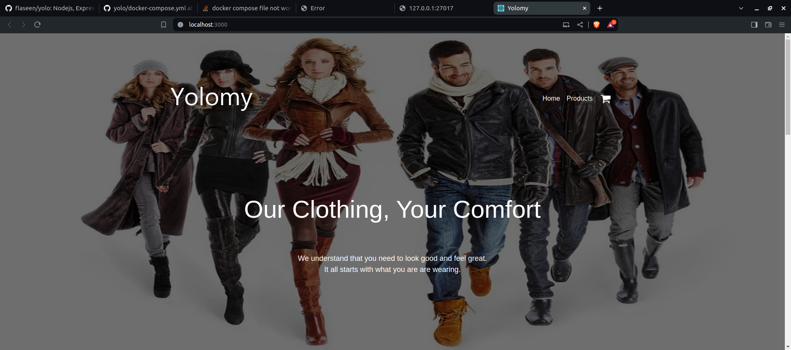
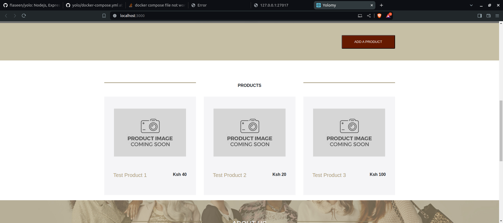
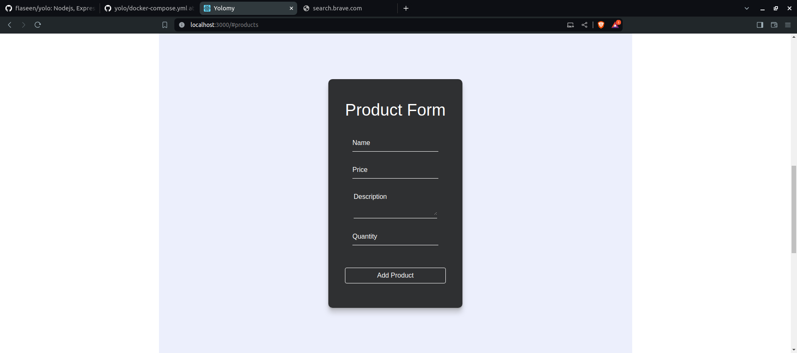

# Requirements
Make sure that you have the following installed:
- [node](https://www.digitalocean.com/community/tutorials/how-to-install-node-js-on-ubuntu-18-04) 
- npm 
- [MongoDB](https://docs.mongodb.com/manual/tutorial/install-mongodb-on-ubuntu/) and start the mongodb service with `sudo service mongod start`

## Navigate to the Client Folder 
 `cd client`

## Run the folllowing command to install the dependencies 
 `npm install`

## Run the folllowing to start the app
 `npm start`

## Open a new terminal and run the same commands in the backend folder
 `cd ../backend`

 `npm install`

 `npm start`

 ### Go ahead and add a product (note that the price field only takes a numeric input)

# Containerizing the App using Docker
 1. Clone the repository

 2. Ensure that you have docker installed

 ## Running all the services at once
    `docker-compose up`
     
   All the containers will be up and running

 ##   To access the front-end 
    'http://localhost:3000/' 
   Use this link to access the front-end application.
  ## sample App screenshots

   
   
   